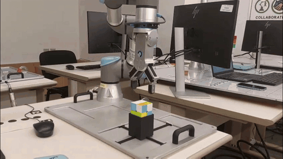
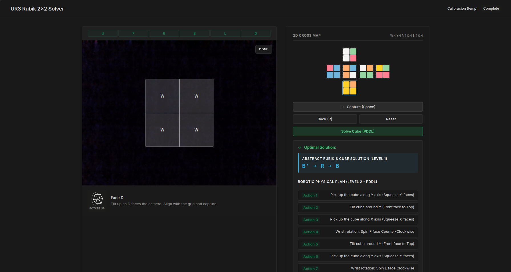
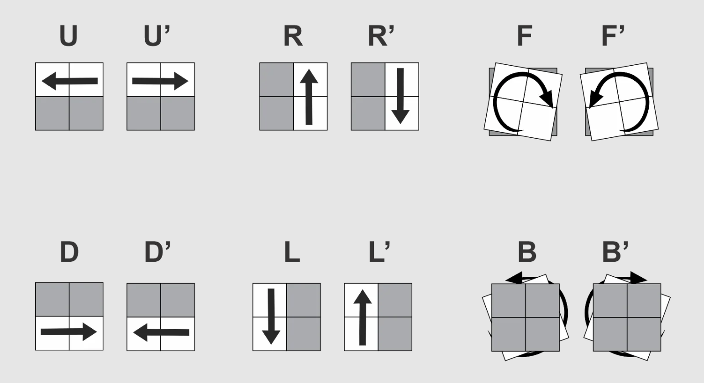
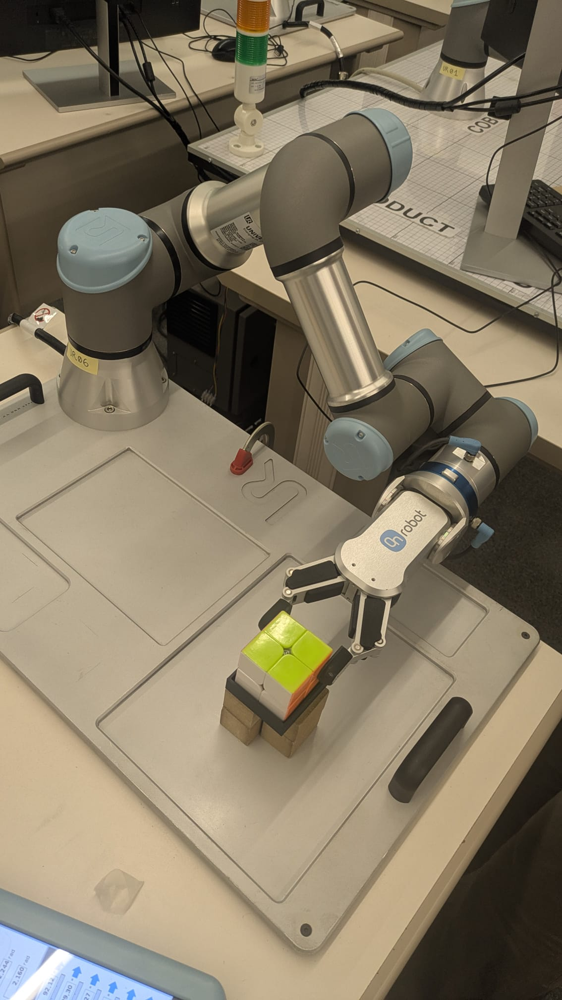
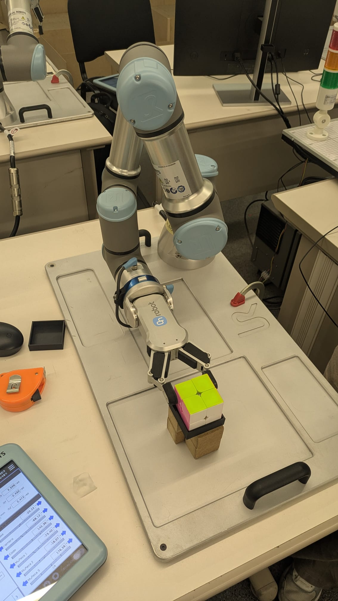
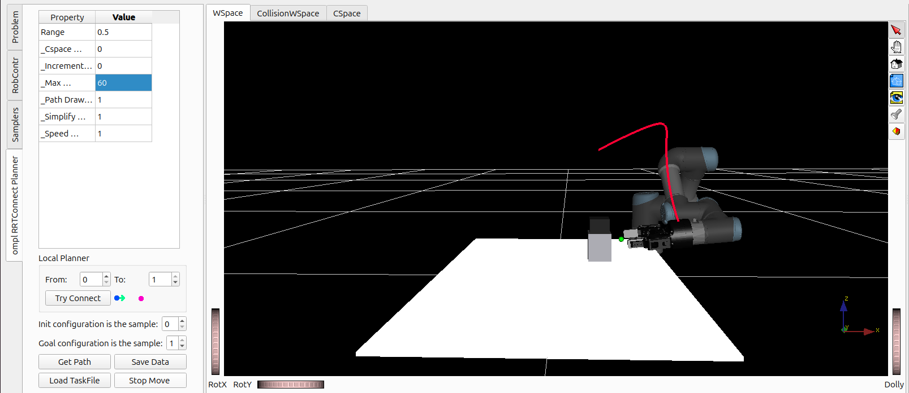
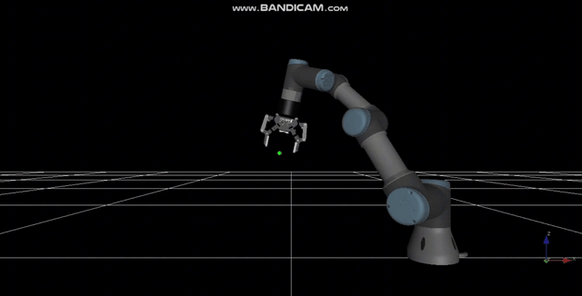
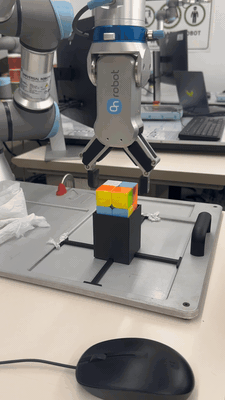
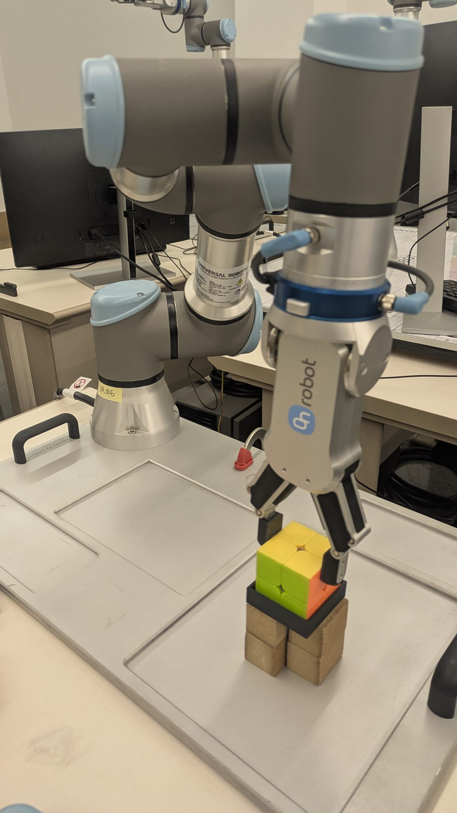
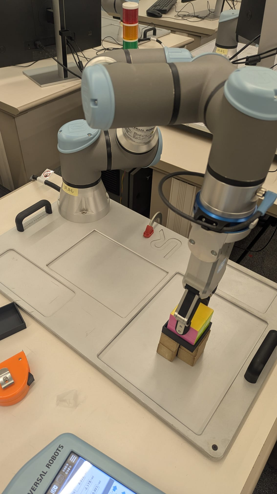

# UR3 Robot Arm 2×2 Rubik's Cube Solver

Hierarchical **Task and Motion Planning (TAMP)** system that solves a physical **2×2 Rubik’s cube** with a **UR3** arm and **OnRobot RG2** gripper: scan → optimal cube solution → PDDL physical plan → Kautham trajectories → robot execution.



*Real robot demo (complex scramble) — mild speed-up (~4×). Full video: [Drive](https://drive.google.com/file/d/1kVuA_HTYCjWttAMZSw8lqLtLuxzHSrzg/view)*

---

## Pipeline overview

| Level | Role | Tech |
|-------|------|------|
| 1 | Abstract cube solution (face turns) | Bidirectional BFS (`robot/solver.py`) |
| 2 | Physical actions under gripper/fixture constraints | PDDL + Fast Downward |
| 3 | Collision-free joint motion | Kautham + OMPL RRT-Connect |
| UI | Scan faces, review colors, trigger solve/execute | Web app (`scan/`) |



*Scanner UI: live camera grid, 2D cross map, Level‑1 moves and Level‑2 robot plan.*

---

## Key Features

1. **Agnostic Rubik's Solver (Level 1 - Bidirectional BFS)**:
    - Uses an optimal **Bidirectional BFS (Breadth-First Search)** algorithm to solve the cube.
    - Solves any valid scramble in less than a millisecond by fixing the bottom-back-left (DBL) corner to reduce the search space.
    - **Corrected 3D Symmetries**: The state permutations, face rotations, and whole-cube rotations are mathematically modeled to match the physical rotations of a 3D Rubik's cube.



2. **Robotic Task Planning (Level 2 - PDDL & Fast Downward)**:
   - Models the physical constraints of a vertical-only top-down robotic gripper (UR3 + OnRobot RG2) and table base fixture in [manipulation_domain.pddl](robot/manipulation_domain.pddl).
   - Fast Downward plans the physical sequence of reorientations (`tilt_x`, `tilt_y`, `pick`, `place`) and regrasps to bring the required faces to the top layer for wrist rotations.





*`tilt_x` (left → top) and `tilt_y` (front → top) on the real setup.*

3. **Motion Planning (Level 3 - OMPL RRT-Connect & Kautham)**:
   - Interfaces with **Kautham** through ROS 2 to plan collision-free joint trajectories, generating a native taskfile with the precise physical grasp, lift, tilt, and wrist rotation curves.



*Kautham: RRT-Connect trajectory for a tilt in the UR3 cell.*

4. **Web Scanner Interface**:
   - Web application serving a 2D scanner calibration grid, interactive 3D preview, and real-time visualization of Level 1 (standard moves) and Level 2 (physical robot actions) plans.

---

## Demos



*Kautham simulation of the planned trajectories (≈4×). Full: [Drive](https://drive.google.com/file/d/1iu62JWyneBOtNVx8bEn5hemZH1a0-Awy/view)*



*Basic real-robot run (≈5×). Full: [Drive](https://drive.google.com/file/d/1bTmDpjsrtFj3eMfIZJTSGgMCqJCQd3Uv/view)*





*Physical cell: UR3 + RG2 — `holding-X` vs `holding-Y`.*

Media catalog: [`assets/README.md`](assets/README.md).

---

## Repository Structure

```
robotica/cub/
├── README.md                          # Project documentation
├── assets/                            # Images, GIFs, demo videos for docs
│   ├── gifs/                          # Sped-up README previews
│   ├── images/                        # notation, hardware, simulation, web, demos
│   └── videos/                        # Full Kautham / real-robot recordings
├── requirements.txt                   # Dependency and system setup specification
├── robot/
│   ├── solver.py                      # Level 1: Optimal Bidirectional BFS Rubik's solver
│   ├── manipulation_domain.pddl       # PDDL representation of UR3 vertical grasp & tilt actions
│   ├── manipulation_problem.pddl      # Dynamically generated PDDL problem
│   ├── try_robot_solve.py             # End-to-end command-line planner validation (no ROS required)
│   └── generate_taskfile.py           # Kautham Taskfile XML generator interface (writes to simulation/)
├── scan/
│   ├── 2x2scaner.py                   # Web server hosting the scanner interface
│   ├── index.html                     # Web UI with 2D cross map and interactive 3D preview
│   ├── cube-interp.js                 # Front-end scanning interpretation and coordinate remapping
│   └── color_calib.json               # Saved color calibration centroids
├── experiments/
│   ├── run_experiments.py             # Automated testing suite running 20 random scrambles
│   └── results.csv                    # Benchmarked metric outputs (planning time, action counts)
├── simulation/
│   ├── rubik_ur3.xml                  # Kautham 3D robot cell problem environment
│   └── rubik_ur3_taskfile.xml         # Generated joint trajectory taskfile for Kautham
└── kautham/
    ├── rubik_cube_2x2.urdf            # Native URDF 3D model for the Rubik's cube obstacle
    ├── square_fixture.urdf            # Table-mounted fixture base model
    ├── task_tilt_x.xml                # Template for RRT trajectory for tilt X action
    └── task_tilt_y.xml                # Template for RRT trajectory for tilt Y action
```

---

## Getting Started

### 1. Web Scanner Server (2D Mapping & 3D Interactive Preview)
Launch the local web scanner using system python to scan physical cubes and plan moves:
```bash
source /home/barrendeiro/robotica/ws_tamp/install/setup.bash
python3 scan/2x2scaner.py
```
Open your browser and navigate to `http://localhost:8000` (or the port shown in the terminal) to interact with the visual interface.

### 2. End-to-End Command-Line Verification
To verify the complete two-level symbolic TAMP pipeline (BFS standard moves + Fast Downward tilts/picks/places) without Kautham or ROS 2 dependencies:
```bash
python3 robot/try_robot_solve.py
```
It generates a random scramble, solves it in standard moves in less than 0.05 seconds, and outputs the optimal robot physical plan to `robot/robot_plan.txt`.

### 3. Running the Automated Benchmarking Suite
Execute the benchmarking suite to run 20 diverse scrambles, measuring execution times, task sizes, and exporting metrics to CSV:
```bash
python3 experiments/run_experiments.py
```
Outputs are fully benchmarked inside `experiments/results.csv`.

---

## Verification in Kautham GUI

1. Open the terminal and launch the Kautham GUI:
   ```bash
   kautham-gui
   ```
2. Go to **`File ➔ Open Problem`** and open `simulation/rubik_ur3.xml` to load the 3D UR3 robotic cell.
3. Plan and visualize:
   * To inspect trajectories, go to the **`Planner`** tab, select the default query, and click **`Plan`** (using `omplRRTConnect`).
   * To animate the entire robotic solution plan generated by `generate_taskfile.py`, go to **`File ➔ Open Taskfile`**, select `simulation/rubik_ur3_taskfile.xml`, and click **`Play`**.
